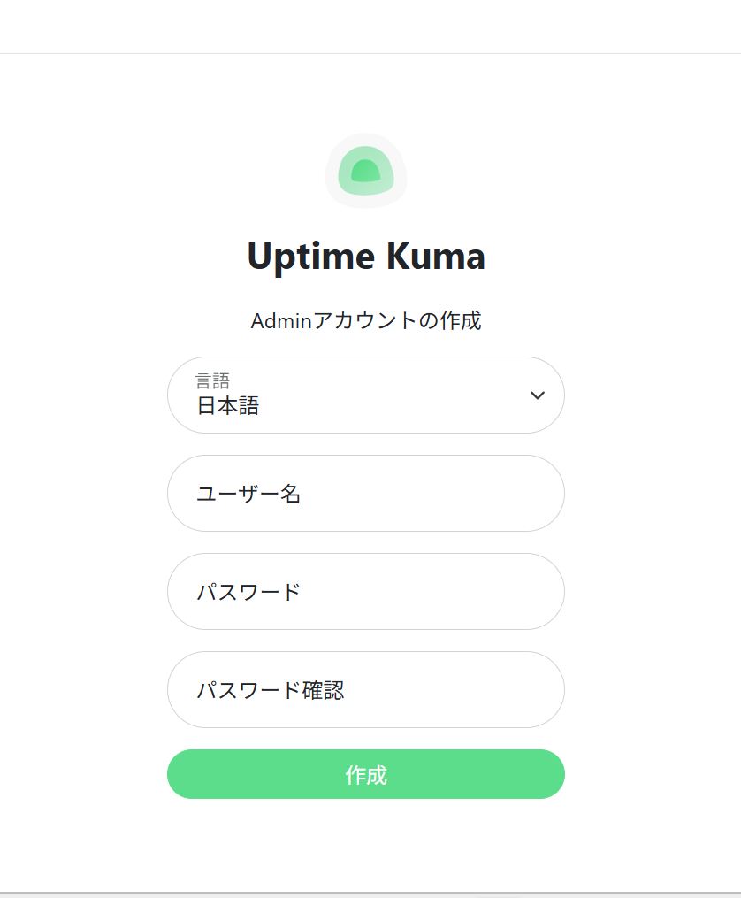
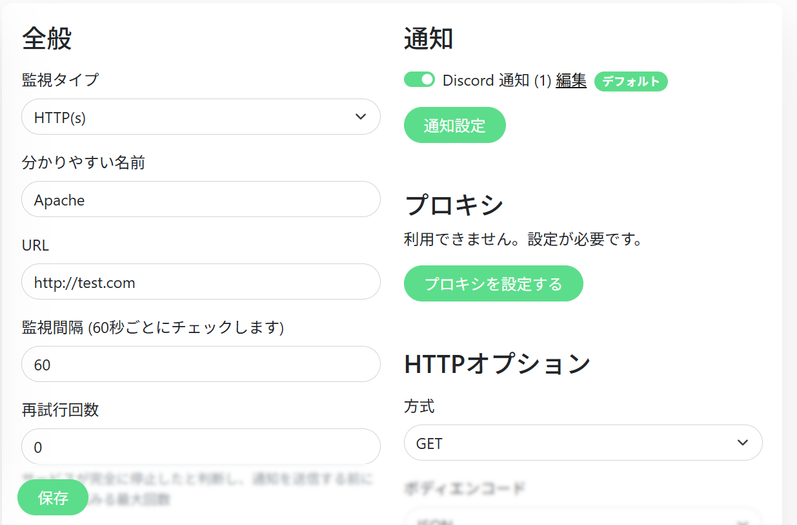
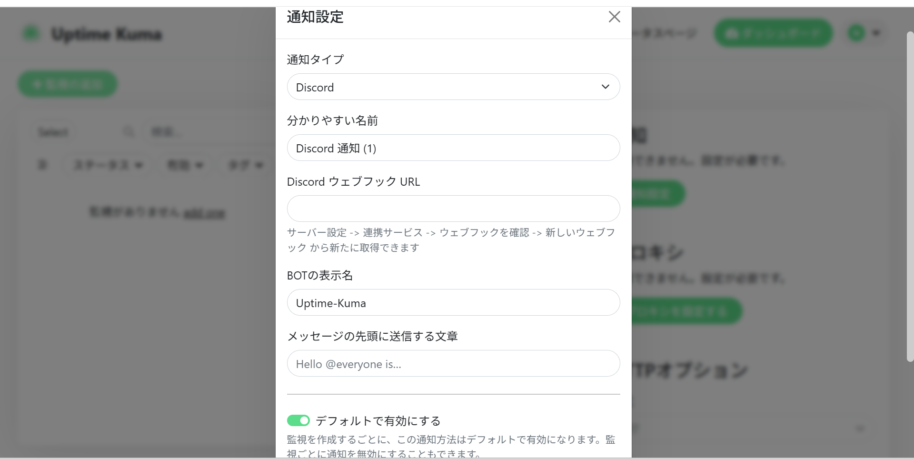
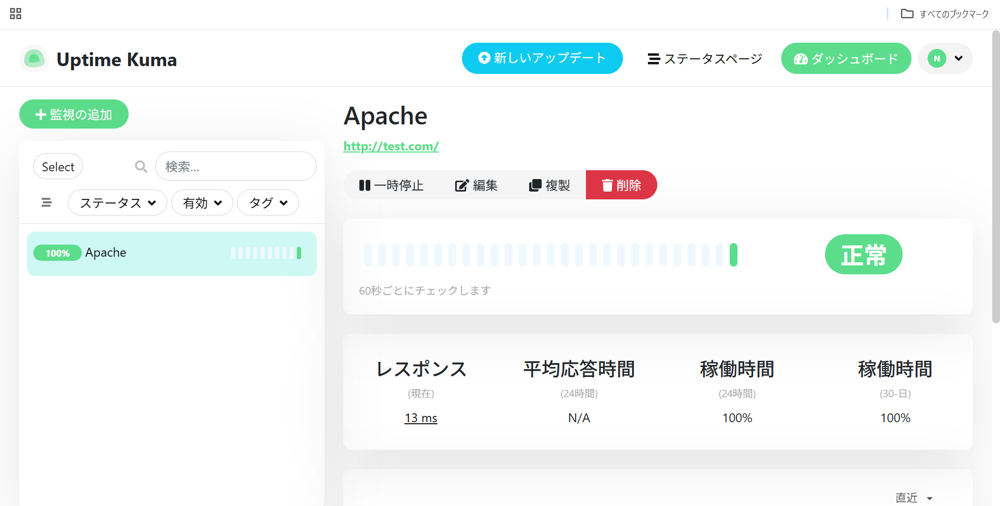
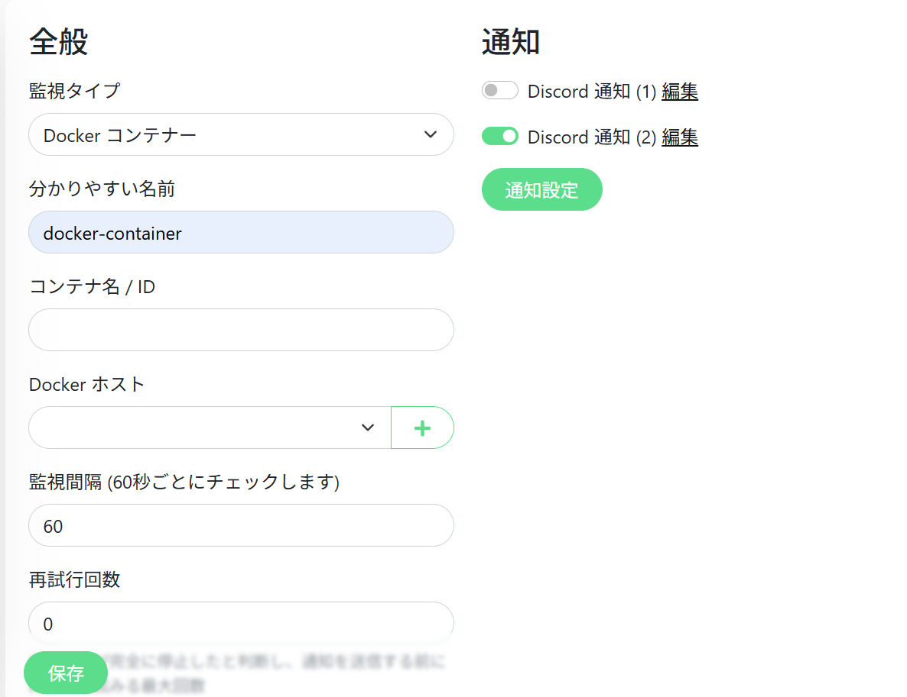
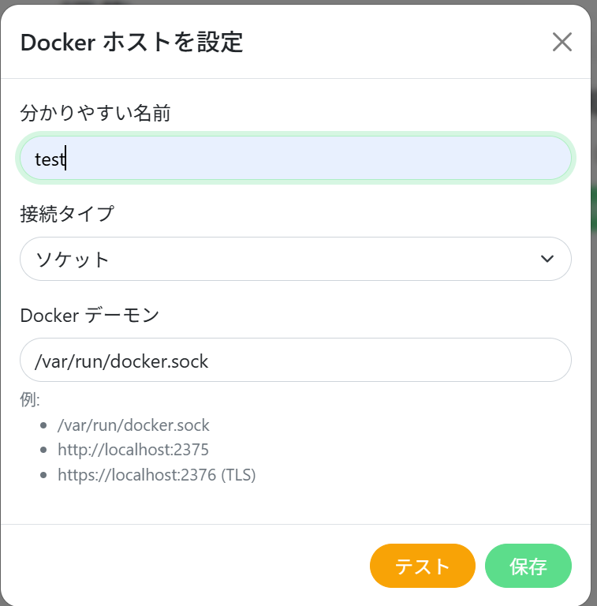

# 軽量監視機能を持ったサーバ構築の手順書

---

## 目次

1. 完成条件
2. 前提条件
3. 事前準備
    * 3-1 WSLのインストール
    * 3-2 Ubuntu24.04 LSTのインストールとアカウント設定
4. 構築手順
    * 4-1 WSL起動と新しいユーザー作成
    * 4-2 SSHのインストールと鍵認証設定
    * 4-3 UFWを用いたファイアウォール設定
    * 4-4 Apacheを用いたHTTPサーバ構築
    * 4-5 DockerのインストールとDocker Composeを使用したコンテナ作成
    * 4-6 Uptime-Kumaのインストールと設定
5. 動作確認
    * 5-1 疎通確認
    * 5-2 ログ確認
    * 5-3. ヘルスチェック (Uptime-Kumaによる監視)
6. トラブルシューティング
7. 参考資料

---

## 1. 完成条件
この手順書で作成するサーバの完成条件はsshの鍵認証で接続し、Apacheで作成したWebサーバ、DockerコンテナをUptime-Kumaで軽量監視ができるようになれば完成。

---

## 2. 前提条件
以下にこの手順書の実行環境を示す。以下の環境以外での動作は確認していない。

* Windows11 24H2
* WSL2
* Ubuntu24.04 LTS
* OpenSSH_9.6p1 Ubuntu-3ubuntu13.14
* ufw 0.36.2
* Apache/2.4.58 (Ubuntu)
* Docker version 29.1.3
* Uptime Kumaバージョン: 1.23.17

---

## 3. 事前準備
以下にサーバ作成前に準備することを説明する。

### 3-1 WSLのインストール
ターミナルもしくはPowerShellを管理者で実行し、以下のコマンドを実行する。

```bash
# WSLのインストールコマンド
wsl --install

# バージョン確認コマンド
wsl --list --verbose
```

上記の方法でインストールした場合はWSL2のはずだが、バージョンが2でない場合は以下のコマンドでバージョンを2に設定する

```bash
# 新しい Linux ディストリビューションがインストールされたとき既定のバージョンをWSL 2 に設定
wsl --set-default-version 2
```

### 3-2 Ubuntu24.04 LSTのインストールとアカウント設定
以下のコマンドを使用してUbuntu24.04 LSTをインストールする。

```bash
# Ubuntu24.04 LTSのインストール
wsl --install Ubuntu-24.04
```
インストールが完了するとUbuntu24.04 LSTのユーザー設定が始まるので、ユーザー名とパスワードを設定します。 設定したユーザー名はWSL起動時に、パスワードはsudoコマンドを使用する際に必要なので忘れないようにする。

## 4. 構築手順

### 4-1 WSL起動と新しいユーザー作成

以下のコマンドでWSLを起動します。`<username>`には先ほど設定したユーザー名を使用します。

```bash
# 特定のユーザーとして WSL を実行する. usernameには先ほど設定したものを使用
wsl --user <username>
```

起動したら表示が`user@xxxxxxxxxx:/mnt/c/Users/xxxx$`のようになることを確認する。ログイン後、まずOSのパッケージリストを更新し、システムを最新の状態にする。

```bash
# 最新の情報に更新
sudo apt update
# インストール済みのソフトウェアパッケージをまとめて最新バージョンに更新
sudo apt upgrade -y
```
以下のコマンドで、新しいユーザー（例: user1）を作成する。

```bash
# user1の部分は任意のユーザー名に変更
sudo adduser user1
```

このコマンドを実行すると、パスワードの設定、氏名などの情報の入力（任意）が求められるので、入力する。事前準備と同様にユーザー名パスワードを忘れないようにする。 新しく作成したユーザーにsudo権限を付与する。

```bash
# ユーザーをsudoグループに追加
sudo usermod -aG sudo user1
# グループに追加されているか確認
id user1
```

今後は新しく作成したユーザーで環境構築するので、ユーザーを切り替える。`<username'>`には新しく作成したユーザー名を使用する。

```bash
# ユーザーの切り替え
su - user1
```

### 4-2 SSHのインストールと鍵認証設定

以下のコマンドでSSHをインストールし、動作を確認する。

```bash
# OpenSSHサーバのインストール
sudo apt install openssh-server
# 動作確認 active (running) ならOK 
sudo systemctl status ssh
# 動作していない場合SSHを動作させる
sudo systemctl start ssh
```

セキュリティ強化のために設定ファイルを以下のように書き換えてログインを制限する。以下のコマンドで設定ファイルを編集。

変更点:

SSHのログインportを22番から2222番に変更 `Port 22` を `Port 2222` に書き換える

rootログインを禁止 `PermitRootLogin prohibit-password` から `PermitRootLogin no` に書き換える

追加点:

特定のユーザーだけログインを許可する `AllowUsers <username> `（`<username>`は新しく作成したユーザー名）

設定したら保存して、以下のコマンドでソケットを無効化してSSHを再起動し、変更を反映させる。

```bash
# ソケットを停止
sudo systemctl stop ssh.socket
# ソケットをSSH起動時に動作させないようにする
sudo systemctl disable ssh.socket
# 再起動して反映 
sudo systemctl restart ssh
```

LinuxサーバのIPアドレスを確認して、Windowsで新しくターミナルを実行しSSHで接続する。

```bash
# IPアドレスを確認(linuxで実行)
hostname -I
# WindowsからSSHでリモートログイン(Windowsで実行)
ssh -p 2222 <username>@<ipaddress>
```

ログインできることを確認したらSSHを一旦ログアウトし公開鍵認証の設定を行う。 以下のコマンドをWindowsで実行し、鍵を作成すする。鍵はEd25519を使用し、作成時の質問はすべてEnterで答える。

```bash
# 鍵を作成
ssh-keygen -t ed25519
```

実行後`~/.ssh/`フォルダに`id_ed25519`と`id_25519.pub`が作成されていればよい。 作成した公開鍵を以下のコマンドでサーバに転送する。

```bash
# サーバに.sshディレクトリを作成し，鍵を転送(Windowsで実行)
type $env:USERPROFILE\.ssh\id_ed25519.pub | ssh -p 2222 <username>@<ipaddress> "mkdir -p ~/.ssh && cat >> ~/.ssh/authorized_keys"
```

実行できたらSSH接続をしてパスワード入力が出なかったら、SSHの設定ファイルの`PasswordAuthentication`の部分を`P`asswordAuthentication no`に変更し、パスワード認証を無効化する。この際エラー時に設定を戻すために新しいターミナル、PowerShellで実行し、SSHで接続する。エラーが何も出なければSSHの鍵認証の設定は完了。

### 4-3UFWを用いたファイアウォール設定

UFWをインストールする。インストール後状態を確認する。

```bash
# UFWのインストール
sudo apt install ufw
# 状態確認
sudo ufw status
```

まずはすべて拒否にして、必要なものだけ許可していく。必要なものはSSHのポート、httpのポート、Uptime-Kuma用のport 3001これらは許可する。

```bash
# デフォルトを拒否に設定
sudo ufw default deny incoming
# SSH接続を許可
sudo ufw allow ssh
# Webアクセスを許可
sudo ufw allow http
# port3001を許可
sudo ufw allow 3001/tcp
# UFWを有効化
sudo ufw enable
# 設定内容を確認
sudo ufw status verbose
```

### 4-4 Apacheを用いたHTTPサーバ構築

以下のコマンドでApacheをインストールする。インストール後起動状態の確認をし、もし動いていなければ起動して自動起動の設定を行う。

```bash
# Apacheのインストール
sudo apt install apache2
# 起動状態の確認 active (running) ならOK
sudo systemctl status apache2
# もし動いていなければ起動する
sudo systemctl start apache2
# 自動起動の設定
sudo systemctl enable apache2
```

ブラウザのアドレスバーに`http://localhost`と入力しApache2 Default Pageという画面が表示されれば成功。

test.comというサイトを作成する。`/etc/apache2/sites-available/test.com.conf`というファイルを作成し、以下の内容を記述する。

```bash
# サイト用のファルダ作成
sudo mkdir -p /var/www/[test.com/html](https://test.com/html)
# 設定ファイルを作成、編集
sudo vi /etc/apache2/sites-available/test.com.conf
```

設定ファイルの内容

```apache
# ポート80へのすべてのリクエストに対して設定ブロックを適用する
<VirtualHost *:80>
  # ドメイン名を指定
  ServerName test.com
  # 別名のドメイン名を指定
  ServerAlias [www.test.com](https://www.test.com)
  # webサイトの公開ディレクトリを指定
  DocumentRoot /var/www/[test.com/html](https://test.com/html)
  # エラー発生時のログファイルの場所を指定
  ErrorLog ${APACHE_LOG_DIR}/error.log
  # 通常のアクセスログファイルの場所とフォーマットを指定
  CustomLog ${APACHE_LOG_DIR}/access.log combined
</VirtualHost>
```

サイトの`index.html`を`/var/www/test.com/html`に作製する。

```bash
# ファイルを作成、編集
sudo vi /var/www/[test.com/html/index.html](https://test.com/html/index.html)
```

サイトの内容（簡易）

```html
<html>
  <body>
    <h1>Test site</h1>
    <p>Test</p>
  </body>
</html>
```

以下のコマンドでサイトを有効にする。

```bash
# サイトを有効化
sudo a2ensite test.com.conf
# リロードして反映
sudo systemctl reload apache2
```

### 4-5 DockerのインストールとDocker Composeを使用したコンテナ作成

Dockerをインストールするために、docker_install.shファイルを作成し、以下の内容を書き込み、Bashコマンドで実行する。

```bash
# インストールコマンド用のファイルを作成、編集
sudo vi docker_install.sh
```

インストールコマンド

```bash
# 競合する古いパッケージの削除
for pkg in docker.io docker-doc docker-compose docker-compose-v2 podman-docker containerd runc; do sudo apt-get remove $pkg; done
# 公式GPGキーの追加
sudo apt-get update
sudo apt-get install ca-certificates curl
sudo install -m 0755 -d /etc/apt/keyrings
sudo curl -fsSL [https://download.docker.com/linux/ubuntu/gpg](https://download.docker.com/linux/ubuntu/gpg) -o /etc/apt/keyrings/docker.asc
sudo chmod a+r /etc/apt/keyrings/docker.asc
# リポジトリの追加
echo \
"deb [arch=$(dpkg --print-architecture) signed-by=/etc/apt/keyrings/docker.asc] [https://download.docker.com/linux/ubuntu](https://download.docker.com/linux/ubuntu) \
$(. /etc/os-release && echo "$VERSION_CODENAME") stable" | \
sudo tee /etc/apt/sources.list.d/docker.list > /dev/null
sudo apt-get update
# インストール
sudo apt-get install docker-ce docker-ce-cli containerd.io docker-buildx-plugin docker-compose-plugin
```

インストールコマンドを入力する際、\の後に文字やスペースを入力しない。

```bash
# ファイルを実行
sudo bash docker_install.sh
```

以下のコマンドを実行して`Hello from Docker!`というメッセージが表示されればインストール成功。

```bash
# hello-worldコンテナを動かしてみる
sudo docker run hello-world
```

現在のユーザーをdockerグループに追加し、sudoなしで実行できるようにする。

```bash
# 現在のユーザーを docker グループに追加
sudo usermod -aG docker $USER
# 設定を反映
newgrp docker
```

Docker Composeを使用して複数のコンテナをまとめて管理する。構成ファイルを作成し、以下の内容を書き込む。

```bash
# ファイル作成
vi compose.yaml
```

ファイルの内容
```yaml
services:
# Webサーバ(Apache HTTPD)
  web:
    image: httpd:latest
    # ホストの8080ポートをコンテナの80ポートにマッピング
    ports:
      - "8080:80"
    # ホストの./htdocsディレクトリをコンテナの公開ディレクトリにマウント
    volumes:
      - ./htdocs:/usr/local/apache2/htdocs/
    # コンテナが停止した場合、常に再起動する
    restart: always
# データベース(MySQL 8.0)
  db:
    image: mysql:8.0
    # 環境変数の設定 (データベースの初期化とrootパスワード)
    environment:
      MYSQL_ROOT_PASSWORD: my-secret-pw
      MYSQL_DATABASE: mydb
    # データを永続化するためのボリュームをマウント
    volumes:
      - db_data:/var/lib/mysql
    # コンテナが停止した場合、常に再起動する
    restart: always

# データの永続化用ボリュームの定義
volumes:
  db_data:
```

作製したコンテナをアップロードする。

```bash
# コンテナ群の作成とバックグラウンドで起動
docker compose up -d
# 起動中のコンテナを表示
docker container ls
# 状態確認
docker compose ps
```
### 4-6 Uptime-Kumaのインストールと設定

homeディレクトリにUptime Kuma用のディレクトリを作成する。

```bash
# ディレクトリを作成し、移動
mkdir -p ~/uptime-kuma && cd ~/uptime-kuma
```

docker-compose.yml ファイルを作成し、以下の内容を記述する。

```bash
# yamlファイルを作成、編集
vi docker-compose.yaml
```

yamlファイルの内容

```yaml
services:
  uptime-kuma:
    # 最新版のUptime Kumaイメージを使用
    image: louislam/uptime-kuma:latest
    container_name: uptime-kuma
    # コンテナが停止した場合、常に再起動するように設定
    restart: always
    # ポート3001番を、コンテナ内部のポート3001番に接続
    ports:
      - "3001:3001"

    volumes:
      # Dockerデーモンと通信するためのソケットファイルをマウント
      - /var/run/docker.sock:/var/run/docker.sock
      # /path/to/dataディレクトリを、コンテナ内部の/app/dataにマウント (ホスト側のパスは適切なものに変更が必要)
      - ./data:/app/data

    environment:
      # タイムゾーンを協定世界時に設定(変更可)
      - TZ=UTC
      # 作成されるファイルのパーミッションマスクを設定
      - UMASK=0022
    networks:
      # kuma_networkというカスタムネットワークにコンテナを接続
      - kuma_network
    healthcheck:
      # コンテナ内で 'curl' コマンドを実行し、ポート3001への接続をテスト
      test: ["CMD", "curl", "-f", "http://localhost:3001"]
      # ヘルスチェックの実行間隔を30秒に設定
      interval: 30s
      # ヘルスチェック失敗時の再試行回数を3回に設定
      retries: 3
      # コンテナ起動後、ヘルスチェックを有効にするまでの待機時間を10秒に設定
      start_period: 10s
      # ヘルスチェックのタイムアウト時間を5秒に設定
      timeout: 5s
    logging:
      # ログドライバーとして json-fileを使用
      driver: "json-file"
      options:
        # 1つのログファイルの最大サイズを10メガバイトに制限
        max-size: "10m"
        # 保持するログファイルの最大数を3つに制限
        max-file: "3"

networks:
  # kuma_networkという名前のネットワークを定義
  kuma_network:
    # ネットワークドライバーとして 'bridge' を指定
    driver: bridge
```

保存し、Docker Composeでアップロードする。

```bash
# アップロード
docker compose up -d
```

アップロードしたら以下のURUでブラウザからUptime-Kumaにアクセスできるようになる。

`http://<ipaddress>:3001`

アクセスするとアカウント作成を求められるので作成する。

<div style="text-align: center;">
    
</div>

アカウント作成後監視の追加をクリックして作成したwebサイト、Dockerコンテナを監視対象に設定する。

webサイトは以下の画像のように設定する。

<div style="text-align: center;">
    
</div>

通知設定をクリックして通知を送る方法を設定する。ここではDiscordのサーバーにwebフックで送信するように以下の画像のように設定し、保存する。

<div style="text-align: center;">
    
</div>

保存をクリックし、保存する。成功すると以下の画像のようになる。

<div style="text-align: center;">
    
</div>

Dockerコンテナは以下の画像のように設定する。複数のコンテナを1つずつ監視設定する。

<div style="text-align: center;">
    
</div>

Dockerホストは以下の画像のように設定する。

<div style="text-align: center;">
    
</div>

通知設定はもう一つDiscordのサーバーにwebフックを作成し、それに送信するように設定する。保存し、ステータスを確認する。

Uptime-Kumaを停止したい場合は、Uptime-KumaのDockerコンテナを停止する。

```bash
# コンテナを停止
docker container stop uptime-kuma
```

これでサーバの構築は終了

---

## 5. 動作確認

### 5-1 疎通確認

| 確認項目 | コマンド/手順 | 期待される結果 |
| :--- | :--- | :--- |
| 基本的な疎通 (Ping) | WindowsのPowerShell/ターミナルで `ping <ipaddress>` を実行 | Ping応答があり、パケットが損失していないこと |
| SSH接続 | WindowsのPowerShell/ターミナルで `ssh -p 2222 <username>@<ipaddress>` を実行 | パスワードの入力なしに、設定したユーザーで鍵認証によりログインできること |
| Apache Webアクセス (Host) | ブラウザで `http://<ipaddress>` にアクセス | 「Apache2 Default Page」が表示されること |
| Apache Webアクセス (VirtualHost) | Windowsのhostsファイル (`C:\Windows\System32\drivers\etc\hosts`) に `<ipaddress> test.com` を追加し、ブラウザで `http://test.com` にアクセス | 作成したindex.htmlの内容が表示されること |
| Docker Compose Webアクセス | ブラウザで `http://<ipaddress>:8080` にアクセス | DockerコンテナのApache (`httpd:latest`) のデフォルトページが表示されること |
| Uptime-Kumaアクセス | ブラウザで `http://<ipaddress>:3001` にアクセス | Uptime-Kumaのログイン画面またはダッシュボードが表示されること |

### 5-2 ログ確認

| サービス | ログファイルの場所/確認コマンド | 確認内容 |
| :--- | :--- | :--- |
| SSH | `sudo tail -n 20 /var/log/auth.log` | 鍵認証によるログイン成功の記録があるか<br>不審なログイン試行がないか |
| Apache (Host) | `sudo tail -n 20 /var/log/apache2/access.log`<br>`sudo tail -n 20 /var/log/apache2/error.log` | アクセスログに疎通確認時のアクセス記録（HTTPステータスコード200）があるか<br>エラーログに起動や設定に関する重大なエラーがないか |
| Apache (VirtualHost) | `sudo tail -n 20 /var/log/apache2/access.log`<br>`sudo tail -n 20 /var/log/apache2/error.log` | `test.com`へのアクセス記録があるか |
| Docker Compose | `docker compose logs` | `web`コンテナと`db`コンテナが正常に起動し、ループエラーなどが起きていない |
| Uptime-Kuma | `docker logs uptime-kuma` | Uptime-Kumaコンテナが正常に起動し、監視対象のチェックが開始されているか |
| UFW | `sudo tail -n 20 /var/log/ufw.log` | 拒否されたパケットが意図したものであり、許可すべきトラフィックが拒否されていないか |

### 5-3. ヘルスチェック (Uptime-Kumaによる監視)

1.  Uptime-Kumaが正しく動作し、設定した監視対象を監視していることを確認。
2.  Uptime-Kumaのダッシュボードにアクセス (`http://<serverIP>:3001`) し、webサイトの監視 (`http://test.com`)、Dockerコンテナの監視 (`web`, `db`など)のステータスが緑色のUPになっていることを確認。
3.  webサイトやDockerコンテナの監視設定で設定した通知方法（Discordなど）で、監視開始の通知が届いているかを確認。
4.  意図的にwebサイトのApacheサービスを停止 (`sudo systemctl stop apache2`) などの操作を行い、Uptime-Kumaがそれを検知し、ステータスがDOWNに変わり、通知が送信されることを確認。確認後、サービスを起動 (`sudo systemctl start apache2`)。

---

## 6. トラブルシューティング

代表的な失敗例と、その対処法をまとめる。

| 失敗例 | 原因の可能性 | 対処法 |
| :--- | :--- | :--- |
| SSHで接続できない (Port 2222: Connection refused) | UFWでポート2222が許可されていない<br>またはSSHサービスが起動していない | `sudo ufw status` で`2222/tcp`が`ALLOW`になっているか確認。なっていなければ `sudo ufw allow 2222/tcp` を実行。SSHサービスが停止していれば `sudo systemctl start ssh` |
| SSHで接続できない (Permission denied (publickey)) | 鍵認証失敗。秘密鍵がサーバの公開鍵と対応していない<br>またはサーバ側の`~/.ssh/authorized_keys`の権限が不適切 | Windows側で鍵のパスを確認。<br>サーバ側で `chmod 700 ~/.ssh` と `chmod 600 ~/.ssh/authorized_keys` を実行し、ファイル内容が正しいか確認。 |
| ApacheのWebサイトにアクセスできない (Connection refused またはタイムアウト) | ポート競合、またはUFWで80番ポートが許可されていない | `sudo ufw status` で`80/tcp`が`ALLOW`になっているか確認。<br>なっていなければ `sudo ufw allow 80/tcp` を実行。 |
| ApacheのWebサイトが403 Forbiddenになる | 権限エラー<br>Webサイトのファイル、ディレクトリの権限がApacheユーザー（`www-data`）にない | Webコンテンツのルートディレクトリ (`/var/www/test.com/html`) に対して、<br>`sudo chown -R www-data:www-data /var/www/test.com` や <br>`sudo chmod -R 755 /var/www/test.com` <br>を実行して権限を修正。 |
| Dockerコンテナが起動しない (port is already allocated など) | ポート競合<br>Docker Composeで指定したホスト側のポート（例: 8080）がすでに別のサービス（例: ホストOSのApacheや別のプロセス）に使用されている | `sudo ss -tulpn`を実行して特定のポートをリスニングしているプロセスを特定し、そのプロセスを停止させるかDocker Composeファイルのポート番号を変更。 |
| Dockerコンテナがすぐに停止する | 設定エラー<br>コンテナ内の設定ファイルや環境変数のミス、または依存するボリュームのマウント失敗 | `docker logs <コンテナ名>` でログを確認し、コンテナ内部で発生しているエラーメッセージ（例: データベース接続失敗、起動スクリプトのエラー）を特定。 |
| Uptime-Kumaに<br>アクセスできない (`http://<serverIP>:3001`) | UFWで3001番ポートが許可されていない、またはUptime-Kumaコンテナが起動していない | `sudo ufw status` で`3001/tcp`が`ALLOW`になっているか確認。<br>`docker compose ps` で`uptime-kuma`コンテナが`Up`になっているか確認。 |

---

## 7. 参考資料

* **WLS**
    * WSL を使用して Windows に Linux をインストールする方法
    * https://learn.microsoft.com/ja-jp/windows/wsl/install
* **Uptime-Kuma**
    * Docker または Docker Compose を使用して Uptime Kuma をインストールする
    * https://uptimekuma.org/install-uptime-kuma-docker/
